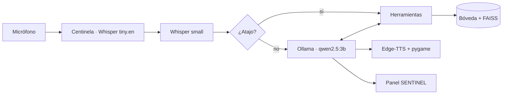

# 🏛️ Arquitectura del Sistema — JinxAS v0.5.0

JinxAS es un asistente de voz local para Windows diseñado bajo una arquitectura modular, concurrente y orientada a la privacidad, combinando reconocimiento de voz (STT), modelos de lenguaje de gran tamaño (LLM), recuperación semántica (RAG) e interfaces nativas con cero dependencia de servicios en la nube para el razonamiento y la indexación.

---

## 1. Diagrama de Flujo General

El siguiente diagrama ilustra el flujo de control y datos desde la captura del audio en el micrófono hasta la respuesta final al usuario y la actualización de la interfaz gráfica:

---

## 2. Subsistemas de la Arquitectura

### 🎙️ 1. Pipeline de Audio Concurrente
La ejecución del asistente se divide en dos hilos concurrentes desacoplados:
- **Hilo Principal (`UI Thread`):** Aloja la ventana nativa de `pywebview` encargada de renderizar el Panel SENTINEL. Gestiona el bucle de eventos del sistema operativo sin bloquear la interfaz.
- **Hilo Secundario (`Voice Daemon Thread`):** Bucle de voz continuo que orquesta:
  1. *Centinela Acústico:* Escucha pasiva de bajo consumo con calibración de energía (`speech_recognition`) y wake-word matching con `openai-whisper tiny.en`.
  2. *Escucha Activa:* Captura del comando completo tras activación usando `openai-whisper small` en español.
  3. *Síntesis y Reproducción:* Síntesis de voz con streaming por oraciones vía `edge-tts` y reproducción de baja latencia con `pygame.mixer`.

### ⚡ 2. Capa de Decisión Rápida (Atajos Deterministas)
Implementada en `jinxas/atajos.py` y optimizada con normalización léxica en `jinxas/comandos.py`:
- **0 ms de LLM:** Evaluación determinista por expresiones regulares previas a cualquier invocación del modelo de lenguaje.
- **Dominios Cubiertos:**
  - Apertura controlada de aplicaciones de escritorio permitidas (`config.MAPA_APLICACIONES`).
  - Métricas instantáneas de CPU, RAM y hardware (`psutil`).
  - Sensores térmicos locales o fallback descriptivo seguro.
  - Consulta del reloj y calendario del sistema operativo.
- **Seguridad:** Los comandos desconocidos son derivados al LLM o devuelven `None`, evitando ejecuciones arbitrarias.

### 🧠 3. Motor Cognitivo (LLM & Tool Calling)
Coordinado en `jinxas/cerebro.py` y `jinxas/__main__.py`:
- **Inferencia Local:** Modelo `qwen2.5:3b-instruct` ejecutado localmente sobre el daemon de **Ollama** con cuantización de 4 bits.
- **Registro Unificado de Herramientas (`registro.py`):** Decorador `@herramienta` que mantiene sincronizados los esquemas de llamadas de Ollama y el diccionario de despacho ejecutable (`FUNCIONES_DISPONIBLES`).
- **Defensa contra Inyecciones Indirectas:** La función `envolver_resultado_tool` delimita el resultado de herramientas bajo bloques `<datos_herramienta>` e instruye al modelo a no obedecer instrucciones embebidas en datos de solo lectura.
- **Gestión de Contexto (`conversacion.py`):** Función pura `recortar(contexto, max_msgs=16)` que conserva el System Prompt (`index 0`), poda la memoria para no desbordar el contexto y purga en bucle llamadas huérfanas con rol `tool` en el punto de corte.

### 📚 4. Memoria y RAG (Bóveda Obsidian + FAISS)
Implementado en `jinxas/memoria.py` y `jinxas/memoria_rag.py`:
- **Representación Vectorial:** Modelo `sentence-transformers/paraphrase-multilingual-MiniLM-L12-v2` ejecutado localmente en CPU.
- **Búsqueda Semántica:** Índice `faiss-cpu` (`IndexFlatIP`) con vectores normalizados L2 (similitud de coseno) y filtrado estricto por `UMBRAL_SIMILITUD_RAG = 0.35`.
- **Caché Incremental Persistente:** Directorio `.jinx_cache/` en la raíz de la bóveda que almacena el índice binario y un manifiesto MD5. Al iniciar o guardar una nota, solo se calculan embeddings para notas modificadas o nuevas.
- **Seguridad en Rutas de Archivos:** Sanitización contra Path Traversal (`_ruta_segura`) y blindaje de nombres de dispositivos reservados en Windows (`CON`, `PRN`, `AUX`, `NUL`, `COM1-9`, `LPT1-9`).

### 🖥️ 5. Interfaz Visual (Panel SENTINEL)
Ubicada en `ui/panel.html` y controlada por `jinxas/interfaz.py`:
- **Arquitectura 100% Offline:** Sin frameworks pesados, dependencias de Node.js ni peticiones a CDNs externas; fuentes locales y CSS puro.
- **Puente Bidireccional Python ↔ JavaScript:**
  - `ControladorPanel`: Emisión de estados (1 a 5), satélites telemetría y mensajes hacia la interfaz vía `evaluate_js()`.
  - `ApiPanel`: Recepción de órdenes desde el frontend hacia el backend (como *Emergency Flush* para limpiar la memoria conversacional en RAM o regenerar la última respuesta).
- **Métricas Reales:** Registro y cálculo sincero de tokens por segundo generados por Ollama (`eval_count` / `eval_duration`), Time to First Audio (`TTFA`) y cronometrado de turno total.
